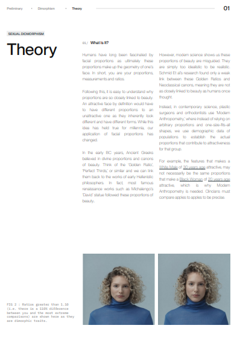
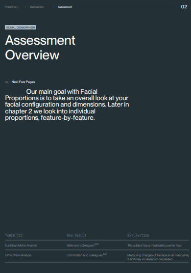
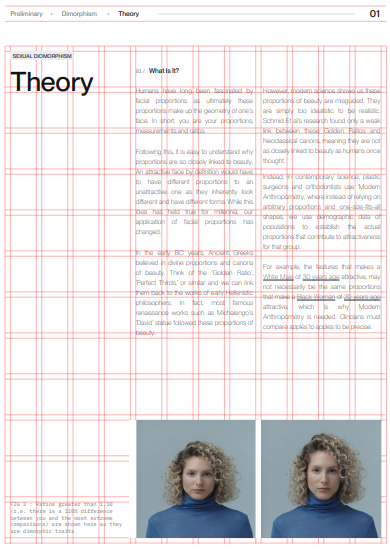
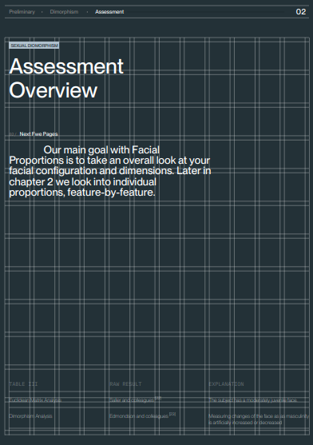

# Customers Report

This project aims to build two pages in ReportLab programmatically. The pages will be built inside a class object, where each class instance represents a Customer's Report with its own handling of states, data, etc.

## Task Description

The task involves the following requirements:

1. Build the two pages using ReportLab.
2. The pages should be built inside a class object.
3. Each class instance represents a Customer's Report.
4. All text can be hardcoded directly within the class as these are static pages.
5. For Task 1, the two paragraphs must be split such that no matter how long the paragraph is, they are split mostly evenly across the two columns.

## Getting Started

To get started with this project, open a terminal and follow the steps below:

### Running locally

1. Clone the repository.

    ```shell
    git clone https://github.com/GabrielaTiago/CustomersReport.git
    ```

2. Navigate to the project folder using the `cd` command. For example:

    ```shell
    cd /path/to/CustomersReport
    ```

3. Create the virtual environment using the command:

    ```shell
    python3 -m venv venv
    ```

4. Activate the virtual environment. The command to do this depends on your operating system:

    - Windows:

    ```shell
    .\venv\Scripts\activate
    ```

    - MacOS/Linux:

    ```shell
    source venv/bin/activate
    ```

5. Install the required dependencies

    ```shell
    pip install -r requirements.txt
    ```

6. Create an `.env` file in the root of the project

    - Windows:

    ```shell
    copy nul .env > nul
    ```

    - MacOS/Linux:

    ```shell
    touch .env
    ```

7. Add the `SHOW_GRID` environment variable to the .env file, just like the `.env.example` fie. Its value must be `True` or `False`

    - If **_SHOW_GRID=True_**, the grid will apper on the pdf

8. Run the main file

    ```shell
    python src/main.py
    ```

To deactivate the venv run `deactivate`

**OBS:** If you get an error of permition to write the file run `chmod u+w .` with admin permition.

### Running on docker

1. Execute the steps 1,2, 6 and 7 of the **Running locally** instructions

2. Build a new docker image `customer-report-pdf`

    ```shell
    docker build -t customer-report-pdf .
    ```

3. Start the container and reference the path to your local folder `/path/to/CustomersReport`

    ```shell
    docker run --rm -v /path/to/CustomersReport/:/app customer-report-pdf
    ```

To remove the created image run `docker rmi customer-report-pdf`

$~$

In both cases the `document` will be placed on the project route.

## Structure

```markdown
├── src/
│ ├── assets/
│ │ ├── fonts/
│ │ │ ├── F37Zagma/
│ │ │ └── montreal/
│ │ └── imgs/
│ │
│ ├── controller/
│ │ ├── init.py
│ │ └── document_controller.py
│ │
│ ├── model/
│ │ ├── init.py
│ │ └── document.py
│ │
│ ├── view/
│ │ ├── init.py
│ │ └── document_view.py
│ │
│ └── main.py
│
├── .gitignore
├── Dokerfile
├── document.pdf
├── README.md
└── requirements.txt
```

## Results

-   PDF with the grid off

<div style="display: flex;">
    <div style="flex: 50%; padding: 5px;">
        
    </div>
    <div style="flex: 50%; padding: 5px;">
        
    </div>
</div>

-   PDF with the grid on

<div style="display: flex;">
    <div style="flex: 50%; padding: 5px;">
        
    </div>
    <div style="flex: 50%; padding: 5px;">
        
    </div>
</div>
